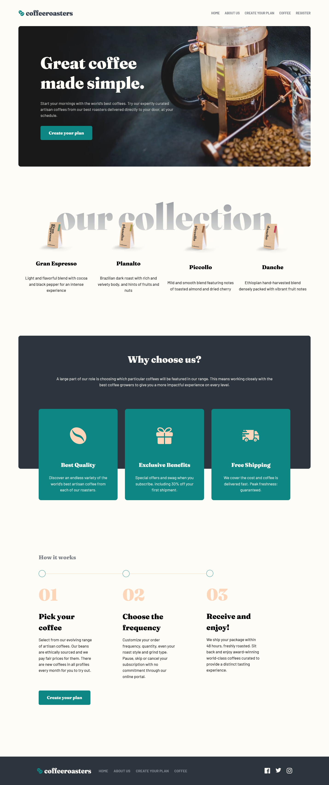

## Table of contents

- [Overview](#overview)
  - [The challenge](#the-challenge)
  - [Links](#links)
- [My process](#my-process)
  - [Built with](#built-with)
  - [What I learned](#what-i-learned)
  - [Continued development](#continued-development)
  - [Useful resources](#useful-resources)
- [Author](#author)


## Overview

### The challenge

Users should be able to:

- View the optimal layout for each page depending on their device's screen size
- See hover states for all interactive elements throughout the site
- Make selections to create a coffee subscription and see an order summary modal of their choices

### Links

- Solution URL: [Github Repo](https://github.com/kebin20/coffee-roasters-website)
- Live Site URL: [Coffee Roasters](https://your-live-site-url.com)

## My process

### Built with

- Semantic HTML5 markup
- CSS custom properties
- Flexbox
- CSS Grid
- CSS Modules
- Mobile-first workflow
- [React](https://reactjs.org/) - JS library
- [React Router](https://reactrouter.com/en/main) - React routing library

### What I learned

Firstly, I learnt how to add an extra property to an object within a data array by the following code using useEffect. When the page renders, a unique ID (using nanoid()) will be added to each object in the array:

```
  useEffect(() => {
    const newPlanData = plan.map((item) => {
      return {
        ...item,
        id: nanoid(),
        content: item.content.map((option) => {
          return {
            ...option,
            id: nanoid(),
          };
        }),
      };
    });
    setPlanOption(newPlanData);
  }, []);
```

<!-- Next, I was struggling in keeping the active button select in order for me to maintain the active style state of each button when selected when customizing the plan, I reused my function from my Quizzical app with modifications as follows:

```
 function holdChoice(planId, optionId, event) {
    event.preventDefault();
    setPlanOption((prevPlanOption) =>
      prevPlanOption.map((plan) => {
        if (plan.id !== planId) return plan;
        return {
          ...plan,
          content: plan.content.map((option) => {
            event.target.value === 'Capsule'
              ? setIsCapsule(true)
              : setIsCapsule(false);
            if (option.id === optionId) {
              return { ...option, isSelected: !option.isSelected };
            } else {
              return { ...option, isSelected: false };
            }
          }),
        };
      })
    );
  }
  ``` -->

### Continued development

This website will be an ongoing project and function as a sandbox to implement new techniques and concepts.

Future implementations:

- Create a "Types of Coffee" page to display common coffee types by fetching data from a Coffee API.
- Create another "Shop" page to display around 6 items for sale and the ability to add it to the custom order plan. In addition, add a add to shopping cart functionality to it too.
- Enable user login to check their account by using BaaS like Firebase for the backend.
- Migrating the project to TypeScript.


### Useful resources

- [Scaler](https://www.scaler.com/topics/text-gradient-css/) - This helped me for creating the text gradient for the title within the homepage.
- [MDN - CSS](https://developer.mozilla.org/en-US/docs/Web/CSS/background-clip) - This doc helped me to create the transparent looking style of the hamburger menu.
- [StackOverflow](https://stackoverflow.com/a/50885613) - This SO thread helped me to understand how to add a br tag in React
- [MDN - CSS](https://developer.mozilla.org/en-US/docs/Web/CSS/pointer-events) - This mdn doc helped me to disable the elements within the button element.

## Author

- Frontend Mentor - [@kebin20](https://www.frontendmentor.io/profile/kebin20)

# Frontend Mentor - Coffeeroasters subscription site solution

This is a solution to the [Coffeeroasters subscription site challenge on Frontend Mentor](https://www.frontendmentor.io/challenges/coffeeroasters-subscription-site-5Fc26HVY6). Frontend Mentor challenges help you improve your coding skills by building realistic projects.
